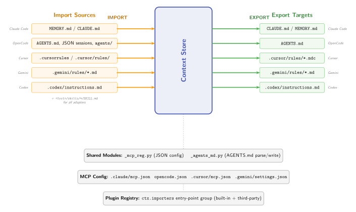

# Adapter Pattern

How Context Teleport bridges between its universal store format and tool-specific file layouts.



## Overview

Each AI coding tool stores context differently:

| Tool | Format |
|------|--------|
| Claude Code | `MEMORY.md`, `CLAUDE.md`, `.claude/rules/*.md` |
| OpenCode | `AGENTS.md`, SQLite sessions |
| Codex | `AGENTS.md`, `.codex/instructions.md` |
| Gemini | `.gemini/rules/*.md`, `GEMINI.md` |
| Cursor | `.cursor/rules/*.mdc` (MDC format), `.cursorrules` |

Adapters translate between these formats and the universal `.context-teleport/` store. The flow is bidirectional:

- **Import**: read tool files, write to store
- **Export**: read from store, write to tool locations

## Protocol

All adapters implement `AdapterProtocol`:

```python
class AdapterProtocol(Protocol):
    name: str
    def detect(self) -> bool: ...
    def import_context(self, dry_run=False) -> dict: ...
    def export_context(self, dry_run=False) -> dict: ...
    def mcp_config_path(self) -> Path | None: ...
    def register_mcp(self, local=False) -> dict: ...
    def unregister_mcp(self) -> dict: ...
```

This is a `@runtime_checkable` protocol, not an abstract base class. Adapters don't inherit from a shared base -- they just implement the interface.

## Import flow

```
Tool-specific files                  Context Store
==================                   ==============

MEMORY.md --------+
CLAUDE.md --------+--- import_context() ---> knowledge/*.md
.claude/rules/ ---+                          knowledge/.meta.json
                                             skills/*/SKILL.md
```

During import:

1. The adapter reads all recognized files from the tool's locations
2. Parses content into knowledge entries, decisions, and skills
3. Writes to the context store via `ContextStore` methods
4. Each entry is attributed with `import:<tool>` as the author

Import is additive -- it does not delete existing store entries.

## Export flow

```
Context Store                        Tool-specific files
==============                       ==================

knowledge/*.md ----+
decisions/*.md ----+--- export_context() ---> CLAUDE.md (managed section)
skills/*/SKILL.md -+                          .claude/skills/*/SKILL.md
```

During export:

1. The adapter reads all **public-scope** entries from the store
2. Converts to the tool's native format
3. Writes to the tool's expected locations
4. For files that mix user and managed content (CLAUDE.md, AGENTS.md), only the managed section is touched

### Managed sections

Export uses HTML comment markers to delimit managed content:

```markdown
<!-- ctx:start -->
## Project Context (managed by Context Teleport)

### Architecture
We use hexagonal architecture with FastAPI.
<!-- ctx:end -->
```

The `_agents_md.py` shared module handles this pattern. Content outside the markers is preserved -- the adapter only replaces between `ctx:start` and `ctx:end`.

## Shared modules

Two shared modules reduce duplication across adapters:

### `_mcp_reg.py` -- MCP config registration

Handles JSON config file operations for tools that store MCP server configs in JSON (Claude Code, OpenCode, Cursor, Gemini).

```python
register_mcp_json(config_path, server_name, command, args, env)
```

- Reads existing config, creates if missing
- Adds or updates the server entry under `mcpServers`
- Sets `MCP_CALLER` env var for agent attribution
- Supports `local=True` to use local Python instead of `uvx`

### `_agents_md.py` -- AGENTS.md management

Handles parsing and writing `AGENTS.md` with managed sections. Used by OpenCode and Codex.

- `parse_agents_md(content)` -- splits into managed and unmanaged sections
- `write_agents_md(managed_content, existing_content)` -- replaces managed section, preserves rest

## Skill handling

Skills use a cross-tool standard format (`SKILL.md` with YAML frontmatter). All adapters store skills in the same way:

```
<tool-dir>/skills/<name>/SKILL.md
```

For example:
- `.claude/skills/deploy-staging/SKILL.md`
- `.gemini/skills/deploy-staging/SKILL.md`
- `.cursor/skills/deploy-staging/SKILL.md`

This means skills can be shared between tools by exporting from one and importing to another, or by syncing through the central store.

## Adapter registry

The registry (`src/ctx/adapters/registry.py`) provides:

- `detect_adapters()` -- runs `detect()` on all adapters, returns those available
- `get_adapter(name)` -- instantiates a specific adapter

Detection checks for tool-specific markers:

| Adapter | Detection criteria |
|---------|-------------------|
| Claude Code | `.claude/` directory or `CLAUDE.md` |
| OpenCode | `AGENTS.md` or `.opencode/` directory |
| Codex | `AGENTS.md` or `.codex/` directory |
| Gemini | `.gemini/` directory or `GEMINI.md` |
| Cursor | `.cursor/` directory or `.cursorrules` |

## MCP registration

Registration is the one-time setup that connects an agent tool to Context Teleport:

```bash
context-teleport register claude-code
```

This writes the MCP server entry to the tool's config file:

```json
{
  "mcpServers": {
    "context-teleport": {
      "command": "uvx",
      "args": ["context-teleport"],
      "type": "stdio",
      "env": { "MCP_CALLER": "mcp:claude-code" }
    }
  }
}
```

The `MCP_CALLER` environment variable is what enables agent attribution -- every write operation reads this variable to tag entries with the calling agent's identity.

## Design decisions

**Why protocols, not inheritance**: Adapters have different internal structures (some manage JSON configs, some manage markdown files, some both). A protocol defines the contract without forcing shared state or method implementations.

**Why managed sections**: Users may have their own content in files like `CLAUDE.md`. Managed sections let Context Teleport update its portion without destroying user content.

**Why `uvx` as default command**: `uvx` resolves the package on demand, so users don't need to install context-teleport in every project's venv. The `--local` flag is available for development.
