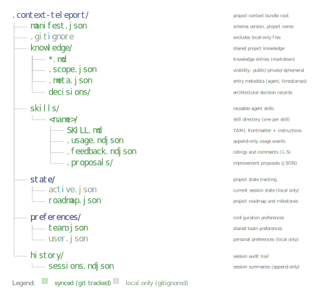

# Bundle Layout

Visual guide to the `.context-teleport/` directory structure, file purposes, and sync behavior.



## Directory tree

```
.context-teleport/
|
+-- manifest.json .............. [synced]    Project metadata, schema version
+-- .gitignore ................. [local]     Auto-generated exclusion rules
|
+-- knowledge/ ................. [synced*]   Knowledge entries
|   +-- architecture.md ........ [synced]    One file per key
|   +-- tech-stack.md .......... [synced]    Plain markdown content
|   +-- local-notes.md ......... [local]     Private scope = gitignored
|   +-- .scope.json ............ [synced]    Scope metadata (private/ephemeral mappings)
|   +-- .meta.json ............. [synced]    Author metadata per entry
|   |
|   +-- decisions/ ............. [synced*]   Architectural Decision Records
|       +-- 0001-use-postgresql.md [synced]  Sequential ADR numbering
|       +-- 0002-hexagonal-arch.md [synced]  ADR-style markdown
|       +-- .scope.json ........ [synced]    Decision scope metadata
|
+-- skills/ .................... [synced*]   Agent skills
|   +-- deploy-staging/ ........ [synced]    One directory per skill
|   |   +-- SKILL.md ........... [synced]    YAML frontmatter + markdown body
|   |   +-- .usage.ndjson ...... [synced]    Append-only usage events
|   |   +-- .feedback.ndjson ... [synced]    Append-only feedback
|   |   +-- .proposals/ ........ [synced]    Improvement proposals
|   |       +-- <uuid>.json .... [synced]    One file per proposal
|   +-- .scope.json ............ [synced]    Skill scope metadata
|
+-- state/ ..................... [mixed]     Session and roadmap state
|   +-- active.json ............ [local]     Current task, blockers (gitignored)
|   +-- roadmap.json ........... [synced]    Team roadmap
|
+-- preferences/ ............... [mixed]     Settings
|   +-- team.json .............. [synced]    Team-wide preferences
|   +-- user.json .............. [local]     Personal preferences (gitignored)
|
+-- history/ ................... [synced]    Session log
|   +-- sessions.ndjson ........ [synced]    Append-only session summaries
|
+-- .pending_conflicts.json .... [local]     Merge conflict state (gitignored)
```

**Legend**: `[synced]` = committed and pushed via git. `[local]` = gitignored, stays on the machine. `[synced*]` = scope-dependent (public = synced, private/ephemeral = local).

## File roles

### Configuration layer

| File | Purpose | Format |
|------|---------|--------|
| `manifest.json` | Project identity, schema version, adapter config, team members | JSON (Manifest model) |
| `.gitignore` | Auto-managed exclusion rules for private/ephemeral content and local state | gitignore format |

The manifest is the first file created by `context-teleport init` and serves as the detection marker for `find_project_root()`.

### Knowledge layer

| File | Purpose | Format |
|------|---------|--------|
| `knowledge/*.md` | One markdown file per knowledge entry. Filename = key. | Markdown |
| `knowledge/.scope.json` | Maps filenames to non-default scopes | JSON dict |
| `knowledge/.meta.json` | Author and timestamp per entry | JSON dict |
| `knowledge/decisions/*.md` | ADR-format decision records with sequential numbering | Markdown (ADR) |
| `knowledge/decisions/.scope.json` | Decision scope metadata | JSON dict |

### Skills layer

| File | Purpose | Format |
|------|---------|--------|
| `skills/<name>/SKILL.md` | Skill definition with YAML frontmatter and markdown body | YAML+Markdown |
| `skills/<name>/.usage.ndjson` | Append-only usage event log | NDJSON |
| `skills/<name>/.feedback.ndjson` | Append-only feedback/rating log | NDJSON |
| `skills/<name>/.proposals/<uuid>.json` | Individual improvement proposals | JSON |
| `skills/.scope.json` | Skill scope metadata | JSON dict |

Tracking files (`.usage.ndjson`, `.feedback.ndjson`, `.proposals/`) are created lazily -- they don't exist until a skill is first used, rated, or has a proposal. This means older stores (pre-v0.4.0) work without migration.

### State layer

| File | Purpose | Sync |
|------|---------|------|
| `state/active.json` | Current task, blockers, progress, last agent | No (gitignored) |
| `state/roadmap.json` | Project milestones and status | Yes |

Active state is deliberately local because it reflects a single session on a single machine. Different developers have different active tasks.

### Preferences layer

| File | Purpose | Sync |
|------|---------|------|
| `preferences/team.json` | Shared settings (default scope, default strategy) | Yes |
| `preferences/user.json` | Personal settings (editor, display preferences) | No (gitignored) |

### History layer

| File | Purpose | Format |
|------|---------|--------|
| `history/sessions.ndjson` | Append-only log of session summaries | NDJSON |

Each line is a `SessionSummary` JSON object with agent identity, summary text, and lists of keys/decisions added.

### Conflict state

| File | Purpose | Sync |
|------|---------|------|
| `.pending_conflicts.json` | Serialized `ConflictReport` for agent-based merge resolution | No (gitignored) |

This file only exists during an active merge conflict resolution. It is created by `context_sync_pull(strategy="agent")` and removed by `context_merge_finalize()` or `context_merge_abort()`.

## Scope and sync interaction

Scope determines whether a file is synced:

| Scope | In .scope.json | Gitignored | Staged on push | Exported |
|-------|---------------|------------|----------------|----------|
| `public` | No (default) | No | Yes | Yes |
| `private` | Yes | Yes | No | No |
| `ephemeral` | Yes | Yes | No | No |

When a scope changes from `public` to `private`:

1. The entry is added to `.scope.json`
2. The file path is added to `.context-teleport/.gitignore`
3. On next push, the file is excluded from staging

When a scope changes from `private` to `public`:

1. The entry is removed from `.scope.json`
2. The file path is removed from `.gitignore`
3. On next push, the file is included in staging

## Append-only patterns

NDJSON files (`sessions.ndjson`, `.usage.ndjson`, `.feedback.ndjson`) use append-only writes. This is a deliberate design choice:

- **Merge-friendly**: Each agent appends new lines. Different agents' lines never conflict because they have unique UUIDs.
- **Auditable**: The full history is preserved. No overwrites.
- **Simple**: Append is the cheapest write operation, with no read-modify-write cycle.

The tradeoff is that files grow over time. For the expected use case (tens to hundreds of sessions), this is not a concern.
