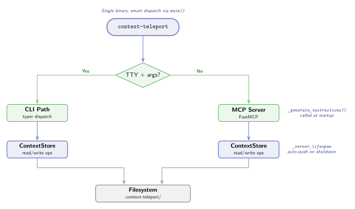

# Data Flow

How requests enter the system, get dispatched, and interact with the context store.



## Entry point dispatch

Context Teleport uses a single binary (`context-teleport`) that dispatches to either the CLI or the MCP server based on runtime context:

```
context-teleport
    |
    +-- TTY + args? --> CLI (typer)
    |
    +-- non-TTY / no args --> MCP Server (FastMCP, stdio)
```

The logic in `src/ctx/_entry.py`:

- If `sys.stdin.isatty()` **and** there are command-line arguments: launch the **CLI** via typer
- If stdin is **not** a TTY (piped) **or** no arguments: launch the **MCP server** on stdio

This means the same binary works both when a user types `context-teleport init` in a terminal and when an agent tool spawns it as an MCP server process.

## CLI path

```
User terminal
    |
    v
typer CLI app (src/ctx/cli/main.py)
    |
    +-- Subcommand dispatch (knowledge, decision, convention, skill, sync, import, export, ...)
    |
    v
ContextStore(project_root)
    |
    v
.context-teleport/ filesystem
```

The CLI instantiates a `ContextStore` from the current working directory (or walks up to find one). Each subcommand calls store methods directly.

For sync operations, the CLI also instantiates `GitSync(project_root)` which wraps git operations.

## MCP server path

```
Agent tool (Claude Code, Cursor, etc.)
    |
    v
stdio transport
    |
    v
FastMCP server (src/ctx/mcp/server.py)
    |
    +-- Auto-init: creates .context-teleport/ if missing in a git repo
    |
    +-- _generate_instructions() at startup
    |       Builds project-aware instructions from store state
    |       Includes: project name, convention keys, knowledge keys,
    |                 decision count, skill names, current task, blockers
    |
    +-- 32 tools, 16 resources, 4 prompts
    |       Each call resolves _get_store() -> ContextStore
    |
    +-- _server_lifespan on shutdown
    |       Best-effort git push of uncommitted changes
    |
    v
ContextStore(project_root)
    |
    v
.context-teleport/ filesystem
```

### Startup: `_generate_instructions()`

When the MCP server starts, it calls `_generate_instructions()` to build a dynamic instruction string that replaces the default fallback. This instruction string includes:

- Project name from manifest
- Team convention keys (listed before knowledge for higher priority)
- List of knowledge entry keys
- Decision count
- Available skill names
- Skills flagged for review (avg rating < 3.0 with 2+ ratings)
- Current task and blockers from active state

This means the agent sees relevant project context immediately at session start, before it even calls any tools.

### Onboarding budget

The instruction string has built-in limits to avoid blowing up the agent's context window on large stores:

- **Content truncation**: Each knowledge, convention, and skill entry is truncated to 2000 characters. A `... (truncated, see full entry via resource)` marker is appended when cut.
- **Key limits**: At most 15 keys are listed inline per content type. Additional keys show as `... and N more`.
- **Entry caps**: Up to 30 knowledge entries, 20 decisions, 20 conventions, and 30 skills are included in the onboarding prompt.
- **Session history cap**: The session history file (`history/sessions.ndjson`) is pruned to the last 200 entries on every write to prevent unbounded growth.
- **Team activity**: Active team members are listed in instructions with staleness markers. Entries older than 48 hours are flagged.

Full data is always available via resources (`context://knowledge`, `context://skills`, etc.) -- the onboarding summary is intentionally a compressed overview.

### Shutdown: `_server_lifespan`

The MCP server uses an async context manager as its lifespan handler. On exit:

1. Check if there are uncommitted changes in the store
2. If yes, attempt `GitSync.push()` as a safety net
3. Errors are silently caught (the server is shutting down regardless)

This ensures that if the agent made changes but didn't explicitly push, the changes are committed and pushed as a best-effort operation.

## Store resolution

Both the CLI and MCP server need to find the project's context store. The resolution chain:

1. `find_project_root()` walks up from the current directory
2. Looks for `.context-teleport/manifest.json`
3. Falls back to the git repository root
4. Returns `None` if neither is found

The MCP server caches the store in a module-level `_store` variable. The CLI creates a new store per invocation.

### Auto-initialization (MCP only)

When the MCP server starts in a git repository that has no `.context-teleport/` directory, it automatically initializes the store using the directory name as the project name. This means registering the MCP server with any agent tool is enough -- no explicit `context-teleport init` step is required. The store is created on first use.

## Data write flow

When a tool or CLI command writes data:

```
context_add_knowledge(key="arch", content="...", scope="public")
    |
    v
ContextStore.set_knowledge(key, content, author, scope)
    |
    +-- Write knowledge/arch.md
    +-- Update knowledge/.meta.json (author, timestamp)
    +-- Update knowledge/.scope.json (if non-default scope)
    |
    v
Files on disk in .context-teleport/
    |
    v
(later) context_sync_push() or auto-push on shutdown
    |
    v
GitSync.push()
    +-- Filter: only stage public-scope files
    +-- git add (filtered files)
    +-- git commit
    +-- git push (if remote exists)
```

## Data read flow

When a tool or resource reads data:

```
context://knowledge (resource)
    |
    v
ContextStore.list_knowledge()
    |
    +-- Glob knowledge/*.md
    +-- Read each file
    +-- Read .scope.json for scope info
    +-- Build KnowledgeEntry list
    |
    v
JSON response to agent
```

Resources are read-only. Tools can read and write.
