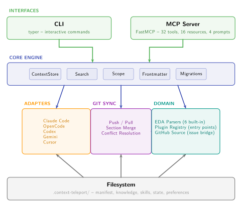

# Architecture

System design and internal component documentation for Context Teleport.

## Design principles

1. **Git as transport** -- All sync happens through git. No custom protocols, no cloud dependencies.
2. **MCP-first interface** -- The MCP server is the primary API. The CLI is for setup and out-of-band operations.
3. **Protocol-based extensibility** -- Adapters and parsers implement typed protocols. Adding a new tool or format requires no changes to core code.
4. **Scope as metadata** -- Visibility boundaries are sidecar files, not content modifications. A file's scope can change without touching its content.
5. **Section-level granularity** -- Markdown merge operates at `## ` section level, not file level. This is the right granularity for multi-agent collaboration.

## Component overview

| Component | Location | Responsibility |
|-----------|----------|---------------|
| Core | `src/ctx/core/` | Schema, store, search, scope, diff, merge, migrations |
| CLI | `src/ctx/cli/` | Typer app with subcommands |
| MCP Server | `src/ctx/mcp/` | FastMCP server (32 tools, 16 resources, 4 prompts) |
| Adapters | `src/ctx/adapters/` | Bidirectional import/export for 5 agent tools |
| Sync | `src/ctx/sync/` | Git push/pull/conflict detection and resolution |
| EDA | `src/ctx/eda/` | EDA project detection and artifact parsers |
| Sources | `src/ctx/sources/` | Remote source importers (GitHub issues) |
| Utils | `src/ctx/utils/` | Path discovery, output formatting, config management |

## Deep dives

- **[Data Flow](data-flow.md)** -- Entry point dispatch, CLI vs MCP paths, auto-sync lifecycle
- **[Adapter Pattern](adapter-pattern.md)** -- Bidirectional adapter architecture and shared modules
- **[Skill Lifecycle](skill-lifecycle.md)** -- Creation, usage tracking, feedback, proposals, upstream sync
- **[Sync Engine](sync-engine.md)** -- Push/pull internals, section-level merge, conflict resolution
- **[Bundle Layout](bundle-layout.md)** -- Visual guide to the `.context-teleport/` directory structure
