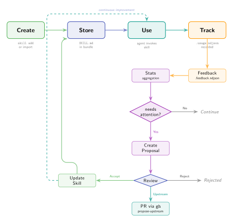

# Skill Lifecycle

The full lifecycle of an agent skill, from creation through usage tracking, feedback, improvement proposals, and upstream contribution.



## Overview

Skills go through a continuous improvement cycle:

```
Create -> Store -> Use -> Track -> Feedback -> Review -> Improve -> Use -> ...
```

Each stage produces data that feeds back into the cycle, enabling skills to evolve based on actual usage patterns and agent feedback.

## Stage 1: Creation

Skills can be created through multiple paths:

**Via MCP tool** (most common):
```
context_add_skill(
    name="deploy-staging",
    description="Deploy to staging environment",
    instructions="## Steps\n1. Run tests\n2. Build image\n..."
)
```

The tool constructs the SKILL.md file with YAML frontmatter automatically via `build_frontmatter()`.

**Via CLI**:
```bash
context-teleport skill add deploy-staging --description "Deploy to staging"
```

Accepts content from `--file`, stdin, or opens `$EDITOR`.

**Via adapter import**:
```bash
context-teleport import claude-code
```

Imports skills from `.claude/skills/*/SKILL.md`.

## Stage 2: Storage

Skills are stored as directories in the context bundle:

```
.context-teleport/
  skills/
    deploy-staging/
      SKILL.md              # YAML frontmatter + markdown body
      .usage.ndjson          # Created lazily on first use
      .feedback.ndjson       # Created lazily on first rating
      .proposals/            # Created lazily on first proposal
    .scope.json              # Scope metadata for all skills
```

The `SkillEntry` model tracks:

| Field | Description |
|-------|-------------|
| `name` | Directory name, used as identifier |
| `description` | From YAML frontmatter |
| `content` | Full SKILL.md file content |
| `updated_at` | Last modification timestamp |
| `agent` | Agent that last wrote the skill |

## Stage 3: Usage tracking

When an agent uses a skill, it records a usage event:

```
context_report_skill_usage(skill_name="deploy-staging")
```

This appends a `SkillUsageEvent` to `.usage.ndjson`:

```json
{"id": "uuid", "session_id": "", "agent": "mcp:claude-code", "timestamp": "2025-01-15T10:00:00Z"}
```

Usage data drives:

- **Adoption metrics**: Which skills are actually being used
- **Frequency patterns**: How often each skill is invoked
- **Agent distribution**: Which agents use which skills

## Stage 4: Feedback

After using a skill, agents rate its quality:

```
context_rate_skill(skill_name="deploy-staging", rating=4, comment="Clear steps, needs rollback section")
```

This appends a `SkillFeedback` entry to `.feedback.ndjson`:

```json
{"id": "uuid", "agent": "mcp:cursor", "rating": 4, "comment": "Clear steps, needs rollback section", "timestamp": "2025-01-15T11:00:00Z"}
```

Rating scale: 1 (poor) to 5 (excellent).

## Stage 5: Stats and attention flags

`SkillStats` is a computed aggregation from the usage and feedback files:

| Field | Description |
|-------|-------------|
| `usage_count` | Total usage events |
| `avg_rating` | Mean of all feedback ratings |
| `rating_count` | Number of feedback entries |
| `last_used` | Timestamp of most recent use |
| `needs_attention` | `True` if avg_rating < 3.0 **and** rating_count >= 2 |

The `needs_attention` flag requires both conditions to avoid flagging skills with a single low rating. It surfaces in:

- `context-teleport skill review` CLI command
- `context://skills/stats` MCP resource
- Dynamic instructions at MCP server startup ("Skills needing review: X, Y")

## Stage 6: Improvement proposals

When a skill needs improvement, agents or users create proposals:

```
context_propose_skill_improvement(
    skill_name="deploy-staging",
    proposed_content="---\nname: deploy-staging\n...",
    rationale="Add rollback step and health check verification"
)
```

A `SkillProposal` is stored in `.proposals/<uuid>.json`:

| Field | Description |
|-------|-------------|
| `id` | UUID |
| `skill_name` | Target skill |
| `agent` | Proposing agent |
| `rationale` | Why the improvement is needed |
| `proposed_content` | Full new SKILL.md content |
| `diff_summary` | Computed diff between current and proposed (via `difflib`) |
| `status` | `pending`, `accepted`, `rejected`, or `upstream` |

## Stage 7: Review and resolution

Proposals are reviewed via CLI:

```bash
# List pending proposals
context-teleport skill proposals --status pending

# Accept a proposal (applies the new content)
context-teleport skill apply-proposal deploy-staging <proposal-id>

# Reject a proposal
context-teleport skill apply-proposal deploy-staging <proposal-id> --reject
```

When a proposal is **accepted**:

1. `status` changes to `accepted`
2. `resolved_at` and `resolved_by` are set
3. The skill's SKILL.md is updated with the proposed content via `set_skill()`
4. The cycle restarts: the improved skill gets used, tracked, and potentially improved again

## Stage 8: Upstream contribution

For skills that come from shared skill packs, accepted improvements can be pushed upstream:

```bash
context-teleport skill propose-upstream deploy-staging <proposal-id> --repo owner/skills-pack
```

This:

1. Clones the upstream repository
2. Creates a feature branch
3. Applies the proposed content
4. Opens a pull request via `gh` CLI
5. Sets proposal status to `upstream`

## Sync behavior

All skill tracking files are synced via git:

| File | Synced | Notes |
|------|--------|-------|
| `SKILL.md` | Scope-dependent | Public by default |
| `.usage.ndjson` | Yes | Append-only, merge-friendly |
| `.feedback.ndjson` | Yes | Append-only, merge-friendly |
| `.proposals/*.json` | Yes | One file per proposal |

NDJSON files are append-only by design, which minimizes merge conflicts in multi-agent scenarios. Each agent appends new lines; lines from different agents never conflict because they have unique UUIDs and timestamps.

## Integration with dynamic instructions

At MCP server startup, `_generate_instructions()` checks for skills needing attention:

```python
all_stats = store.list_skill_stats()
attention = [s.skill_name for s in all_stats if s.needs_attention]
if attention:
    lines.append(f"Skills needing review: {', '.join(attention)}.")
```

This means agents are proactively informed about skills that need improvement, without needing to check stats explicitly.
